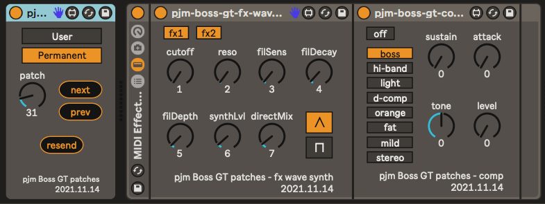

pjm-boss-gt-patches - Max for Live device for patch selection of the Boss GT-001
--------------------------------------------------------------------------------

This is a Max for Live MIDI Effect device. It is used to set the current patch
on a [Boss GT-001 device][]. It may work with other Boss GT devices, but I only
have the 001.

[Boss GT-001 device]: https://www.boss.info/global/products/gt-001/

The **User** / **Permanent** buttons switch between the user editable patches
and the system provided non-editable patches. The **patch** dial chooses the
patch in that bank, from 1 - 200. The **prev** and **next** buttons will change
the patch to the previous one - from 1 to 2, etc. The patch will rollover when
using **next** at 200 or **prev** at 1, but will remain in the same bank. The
**resend** button will send the current settings to the GT-001, if for some
reason it's not synchronized with this device.

The patch settings _should_ be sticky for the Live Set the patch is in. When you
open the Live Set, it should send the saved patch to the device. If not, use the
**resend** button.

Using multiple of these devices in a Live Set doesn't do what you think it
might, if you wanted to have several patches preset in a Live Set, and switch
between them easily. That's good fodder for another device, actually.

What this device is best for is browsing the patches live. Map the **prev** and
**next** buttons to a MIDI footswitch, and you can the switch between patches to
preview them with a foot press.

usage
================================================================================

Since this is a Max for Lie MIDI Effect device, it needs to be added to a MIDI
track. That MIDI track will need to have it's output set to go to the GT-001
MIDI port. I suggest creating a new track GT-001 with this device in it, and a
MIDI Monitor device before and after it, disabled, but ready to help out for
debugging if needed.

You can also set the input MIDI port to the same GT-001 MIDI port, in which case
any changes you make to the GT-001 on the device itself, or via a pedal attached
to that device, will be reflected back in this UI, and then saved. You would
want to do this if you have a pedal connected to the GT-001 that already
switches through the patches, and then have those changes saved in the Live Set.

I haven't played with somehow using this in an automated way.  Perhaps possible?

references
================================================================================

- Boss GT-001 manuals, including the critical **MIDI Implementation**:

  https://www.boss.info/global/support/by_product/gt-001/owners_manuals/

- other gt-001 stuff from me, generally in a state of disrepair: 

  https://github.com/pmuellr/pjm-boss-gt001

changelog
================================================================================

version 2021-04-03

- initial version
